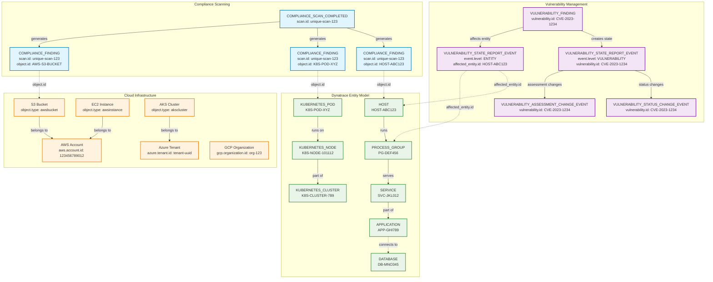
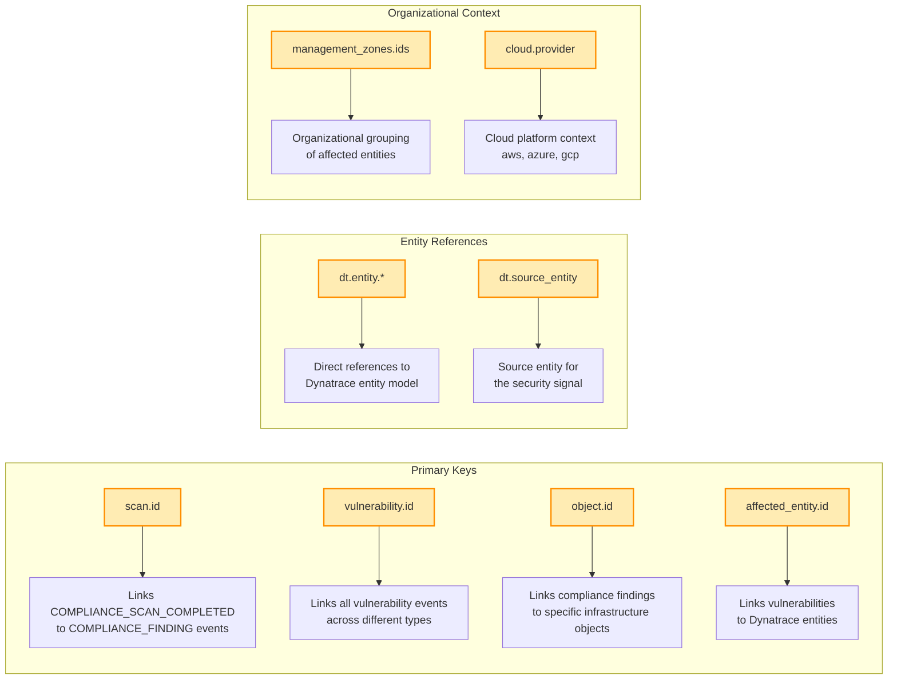
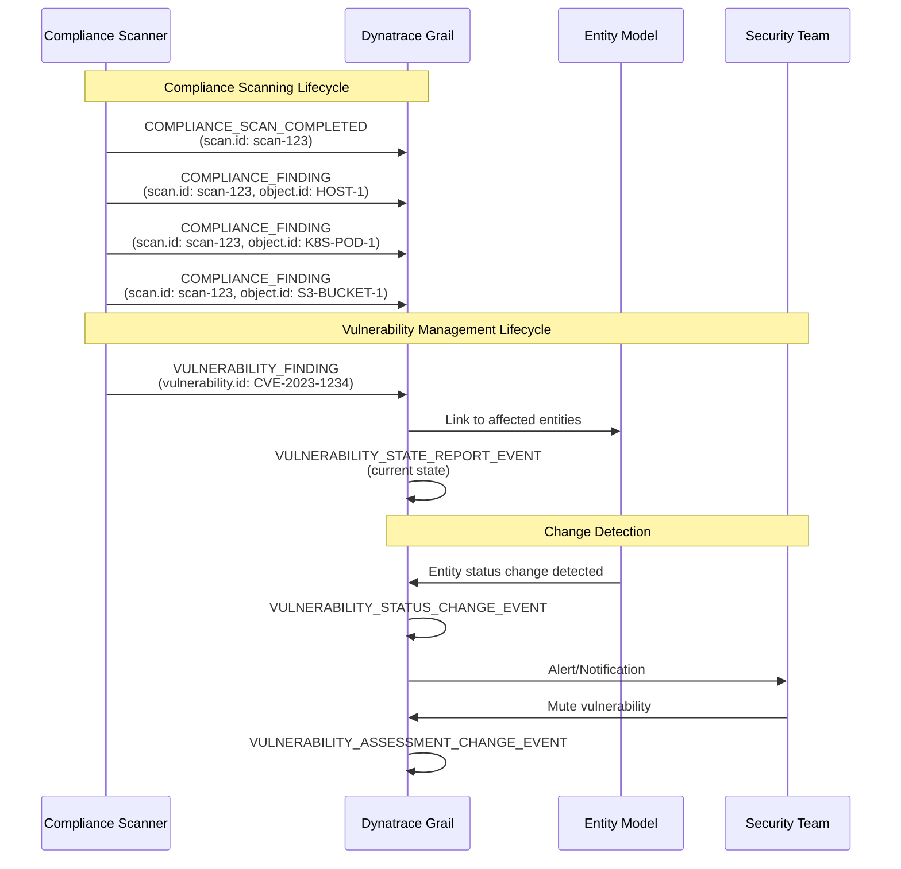
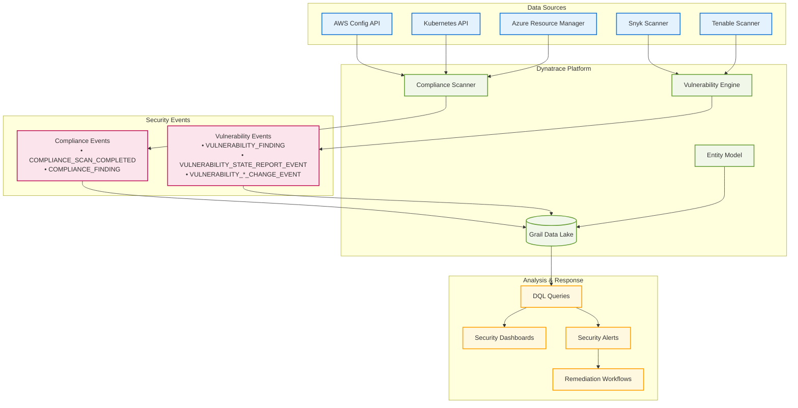

# Dynatrace Security Events Relationship Diagram

## Event Flow and Relationships

## Key Relationship Fields

## Event Lifecycle Patterns

## Data Flow Architecture

## Usage Instructions

### Viewing the Diagrams

1. **GitHub/GitLab**: Diagrams render automatically in markdown files
2. **VS Code**: Install "Markdown Preview Mermaid Support" extension
3. **Online**: Copy to [Mermaid Live Editor](https://mermaid.live/)
4. **Documentation Sites**: Most support Mermaid rendering (GitBook, Notion, etc.)

### Key Insights from Diagrams

1. **scan.id** is the primary relationship key for compliance events
2. **vulnerability.id** links all vulnerability-related events
3. **object.id** and **affected_entity.id** connect events to infrastructure
4. Events flow from detection → state reporting → change tracking
5. Entity model provides the foundation for all security event relationships
