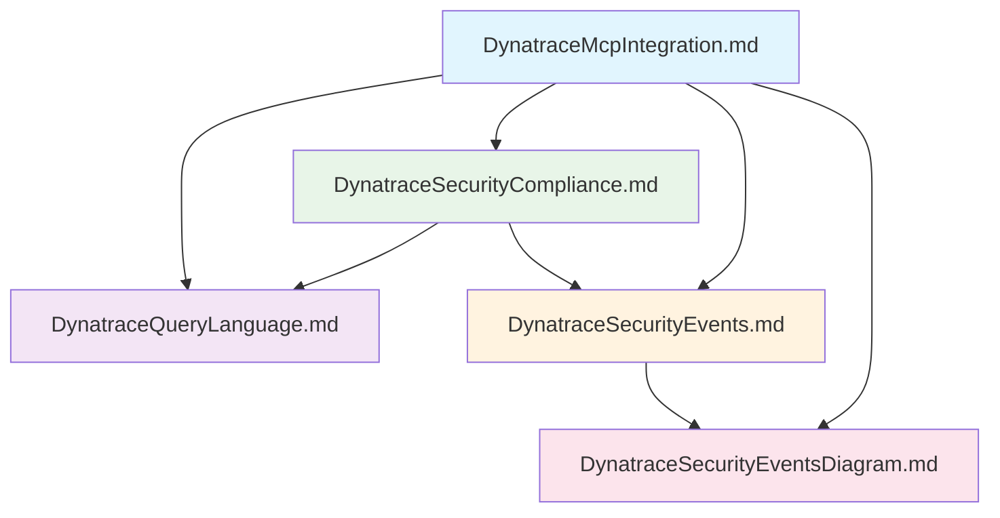

# Dynatrace MCP Integration Rules

This directory contains rule files that guide the AI assistant in analyzing Dynatrace security and compliance data through the MCP (Model Context Protocol) integration.

## 🚀 Installation Instructions

### 1. Install Dynatrace MCP Server

Ensure the Dynatrace MCP server is correctly installed and configured with your Dynatrace environment credentials.

### 2. Copy Integration Rules

Place all 5 integration rule files in your IDE's AI plugin rules folder:

**IDE-Specific Locations:**

- **Amazon Q**: `.amazonq/rules/` (project) or `~/.aws/amazonq/rules/` (global)
- **Cursor**: `.cursor/rules/` (project) or via Settings → Rules (global)
- **Windsurf**: `.windsurfrules/` (project) or via Customizations → Rules (global)
- **Cline**: `.clinerules/` (project) or `~/Documents/Cline/Rules/` (global)
- **GitHub Copilot**: `.github/copilot-instructions.md` (project only)

**Required files:**

- `DynatraceMcpIntegration.md`
- `DynatraceQueryLanguage.md`
- `DynatraceSecurityCompliance.md`
- `DynatraceSecurityEvents.md`
- `DynatraceSecurityEventsDiagram.md`

### 3. Activate the Agent

In your AI chat, type:

```
load dynatrace mcp
```

The Dynatrace agent will initialize and provide analysis capabilities.

## File Structure & Interactions



## Core Files

### 🔄 **DynatraceMcpIntegration.md** (Main Entry Point)

- **Purpose**: Generic integration guide and analysis mode selector
- **Key Features**:
  - 6 analysis modes (vulnerabilities, compliance, problems, entities, logs, custom DQL)
  - Platform-agnostic integration architecture
  - Post-analysis workflow guidance
  - Generic data sources and capabilities overview
- **Dependencies**: References all other files for specific guidance

### 🔍 **DynatraceQueryLanguage.md** (DQL Foundation)

- **Purpose**: Core DQL syntax and best practices for general use
- **Key Features**:
  - Pipeline-based query structure
  - Time range control patterns
  - Basic DQL commands and functions
  - General best practices and syntax corrections
- **Used By**: All analysis modes requiring DQL syntax knowledge

### 🛡️ **DynatraceSecurityCompliance.md** (Security & Compliance Analysis)

- **Purpose**: Complete security and compliance analysis guide
- **Key Features**:
  - Security events architecture overview
  - Latest scan analysis patterns
  - Time range requirements by platform
  - Team-specific remediation guidance
  - **Threat observability DQL examples**
  - **Vulnerability analysis patterns**
  - **Container security analysis**
  - **Advanced entity analysis with ownership**
- **Dependencies**: Uses DQL patterns and security events structure

## Reference Files

### 📊 **DynatraceSecurityEvents.md** (Data Schema)

- **Purpose**: Complete security events reference
- **Key Features**:
  - Event types and attributes
  - Relationship fields
  - Query examples for each event type
- **Used By**: All security-related analysis modes

### 📈 **DynatraceSecurityEventsDiagram.md** (Visual Reference)

- **Purpose**: Visual representation of event relationships
- **Key Features**:
  - Event flow diagrams
  - Data architecture visualization
  - Relationship mapping
- **Complements**: DynatraceSecurityEvents.md with visual context

## Usage Flow

1. **Start**: User requests analysis → **DynatraceMcpIntegration.md** selects appropriate mode
2. **Query Building**: Mode uses **DynatraceQueryLanguage.md** for DQL syntax
3. **Security Analysis**: Compliance/vulnerability modes reference **DynatraceSecurityCompliance.md**
4. **Data Understanding**: All modes can reference **DynatraceSecurityEvents.md** for event structure
5. **Visualization**: Complex relationships explained via **DynatraceSecurityEventsDiagram.md**

## Key Principles

- **DQL-First Approach**: Prefer DQL queries over native MCP calls for vulnerability analysis
- **Latest Scan Focus**: Always analyze most recent scan data, never aggregate over time
- **Extended Timeframes**: Use 24h+ for cloud provider findings, default for Kubernetes
- **Remediation-Driven**: Always offer follow-up remediation options after analysis

## Quick Reference

| Analysis Type       | Primary File                   | Supporting Files                                      |
| ------------------- | ------------------------------ | ----------------------------------------------------- |
| Vulnerabilities     | DynatraceMcpIntegration.md     | DynatraceQueryLanguage.md, DynatraceSecurityEvents.md |
| Compliance          | DynatraceSecurityCompliance.md | DynatraceQueryLanguage.md, DynatraceSecurityEvents.md |
| Custom DQL          | DynatraceQueryLanguage.md      | DynatraceSecurityEvents.md                            |
| Event Understanding | DynatraceSecurityEvents.md     | DynatraceSecurityEventsDiagram.md                     |
